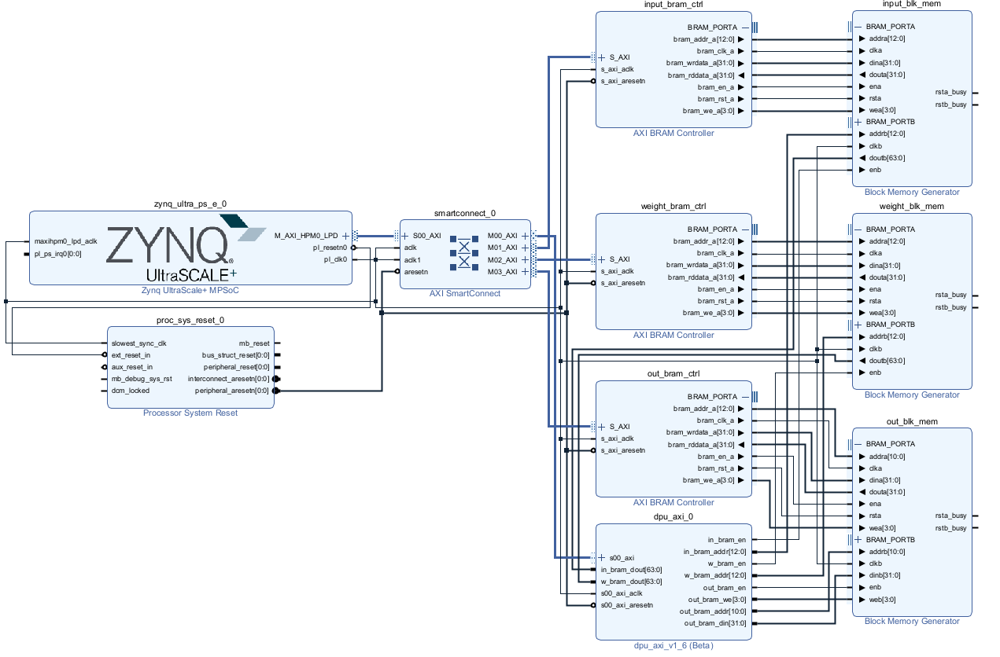
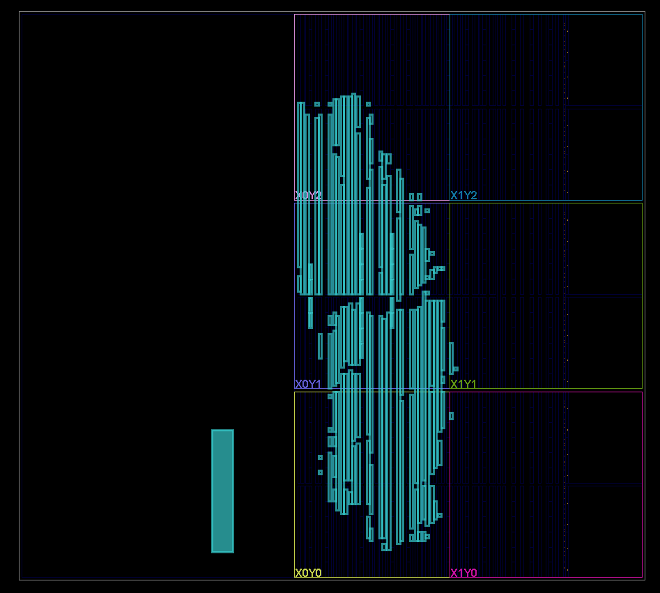

# FPGA Systolic-Array ML Accelerator

A synthesizable machine-learning accelerator built around a parameterizable systolic multiply-accumulate (MAC) array and implemented in SystemVerilog.

The project targets the AMD/Xilinx Zynq UltraScale+ MPSoC and explores hardware/software co-design for matrix-multiplication workloads. The accelerator was developed first as a standalone RTL design and later integrated with the Zynq processing system using AXI and dual-port Block RAM (BRAM).

The current implementation uses an **8×8 systolic array containing 64 parallel MAC processing elements (PEs)** with signed 8-bit operands.

> **Development status:** The standalone compute architecture has been verified in RTL simulation. The SoC implementation has been synthesized, implemented, programmed, and partially validated on physical FPGA hardware. AXI/BRAM communication, accelerator control, and a single MAC datapath have been demonstrated in hardware. Full 8×8 hardware validation is still in progress; see [Current Status](#current-status).

---

## Architecture

The project consists of two main implementations:

### Standalone DPU

The standalone implementation contains the core accelerator RTL and is intended for simulation and direct verification of the systolic architecture.

```text
                 Weight Inputs
               ↓  ↓  ↓  ... ↓

Input 0  →    PE → PE → PE → ... → PE
               ↓    ↓    ↓          ↓
Input 1  →    PE → PE → PE → ... → PE
               ↓    ↓    ↓          ↓
   ...         ...  ...  ...        ...
               ↓    ↓    ↓          ↓
Input 7  →    PE → PE → PE → ... → PE

                 8 × 8 Array
                   64 PEs
```

Each processing element performs:

```text
accumulator ← accumulator + input × weight
```

Inputs propagate horizontally through the array while weights propagate vertically.

Each PE can perform one MAC operation per enabled clock cycle, allowing up to **64 MAC operations per cycle** when all 64 PEs are active.

### Zynq SoC Integration

The second implementation integrates the accelerator with the ARM Cortex-A53 processing system on the Zynq UltraScale+ MPSoC.

```text
                   ┌──────────────────────┐
                   │    ARM Cortex-A53    │
                   │    Bare-Metal C++    │
                   └──────────┬───────────┘
                              │
                        AXI Memory Map
                              │
                   ┌──────────▼───────────┐
                   │  AXI Interconnect /  │
                   │    SmartConnect      │
                   └──────────┬───────────┘
                              │
              ┌───────────────┼────────────────┐
              │               │                │
              ▼               ▼                ▼
        Input BRAM       Weight BRAM      Output BRAM
              │               │                ▲
              │               │                │
              └──────────┐    │    ┌───────────┘
                         ▼    ▼
                    ┌─────────────┐
                    │  DPU Core   │
                    │ 8×8 Systolic│
                    │    Array    │
                    └─────────────┘
```

The processor loads operands into BRAM, configures and starts the accelerator through memory-mapped control registers, waits for computation to complete, and reads the results from output BRAM.

---

## Processing Element

The basic computational unit is a signed multiply-accumulate PE.

Conceptually:

```systemverilog
if (clear)
    accumulator <= 0;
else if (enable)
    accumulator <= accumulator + input_value * weight_value;
```

In addition to performing the MAC operation, each PE registers and forwards:

- the input operand to the next PE horizontally;
- the weight operand to the next PE vertically.

This produces the pipelined data movement characteristic of a systolic architecture.

---

## Systolic Array

The current configuration uses:

| Parameter | Current Configuration |
|---|---:|
| Array dimensions | 8 × 8 |
| Processing elements | 64 |
| Operand width | 8-bit signed |
| Accumulator width | 20-bit signed |
| Input lanes | 8 |
| Weight lanes | 8 |
| Input datapath | 64 bits |
| Weight datapath | 64 bits |
| Peak parallelism | 64 MACs/cycle |

The RTL is parameterized so that array and datapath dimensions can be modified without manually instantiating individual processing elements.

For the current 8×8 controller, the systolic feed/drain schedule uses:

```text
TOTAL_CYCLES = 3N - 2
```

which gives:

```text
3(8) - 2 = 22 cycles
```

for the current configuration.

This should not be interpreted as an entire matrix multiplication occurring in one clock cycle. Instead, the 64 PEs operate concurrently while operands move through the systolic array over multiple cycles.

---

## RTL Hierarchy

The accelerator is organized approximately as:

```text
DPU_Top
│
├── DPUCore
│   │
│   └── MACArray
│       │
│       └── PEUnit / MACUnit × 64
│
└── ActivationSelect
```

### `PEUnit`

Implements an individual MAC operation and forwards operands to neighboring PEs.

### `MACArray`

Generates the two-dimensional systolic array and connects horizontal and vertical operand propagation between PEs.

### `DPUCore`

Wraps the systolic compute array and provides the primary compute interface.

### `ActivationSelect`

Applies a selectable activation operation to the computed output.

Implemented operations include:

- No activation / bypass
- ReLU
- Leaky ReLU

### `DPU_Top`

The SoC-oriented top level handles:

- BRAM addressing
- BRAM read timing
- compute control
- systolic-array enable/clear
- activation
- output serialization
- output BRAM writes
- `busy` / `done` status generation

---

## Accelerator Controller

The current SoC controller follows approximately:

```text
              START
                │
                ▼
          ┌───────────┐
          │   IDLE    │
          └─────┬─────┘
                │
                ▼
          ┌───────────┐
          │  COMPUTE  │
          └─────┬─────┘
                │
                ▼
        ┌──────────────┐
        │ WRITE_OUTPUT │
        └──────┬───────┘
               │
               ▼
          ┌───────────┐
          │   READY   │
          └─────┬─────┘
                │
                └──────→ IDLE
```

The processor controls execution through the custom AXI peripheral.

A typical software transaction is:

```text
1. Write input matrix data to input BRAM
2. Write weight matrix data to weight BRAM
3. Select activation function
4. Assert START
5. DPU enters COMPUTE
6. Poll status register for DONE
7. DPU writes results to output BRAM
8. Processor reads output BRAM
9. Deassert START
```

---

## BRAM Architecture

The design uses separate memories for:

- input data;
- weights;
- output data.

Input and weight memories use dual-port BRAM so that the processor and accelerator can access the memory through separate interfaces.

```text
                    Dual-Port BRAM

Cortex-A53                                 DPU
    │                                      │
    ▼                                      ▼
AXI BRAM                                Native
Controller                              BRAM Port
    │                                      │
    ▼                                      ▼
  Port A  ┌────────────────────────┐     Port B
─────────►│                        │────────────►
          │         BRAM           │
─────────►│                        │────────────►
          └────────────────────────┘
```

In the tested configuration, the processor-facing BRAM interface uses 32-bit accesses while the DPU-facing input/weight interface is 64 bits wide.

Each 64-bit DPU word represents eight signed 8-bit operands:

```text
63                                              0
┌──────┬──────┬──────┬──────┬──────┬──────┬──────┬──────┐
│Lane 7│Lane 6│Lane 5│Lane 4│Lane 3│Lane 2│Lane 1│Lane 0│
└──────┴──────┴──────┴──────┴──────┴──────┴──────┴──────┘
   8b     8b     8b     8b     8b     8b     8b     8b
```

The software therefore performs two 32-bit AXI writes when constructing a 64-bit accelerator input word.

---

## AXI / Software Interface

Bare-metal C/C++ software runs on the Cortex-A53.

Memory-mapped accesses use the Xilinx standalone BSP, including:

```cpp
Xil_Out32(address, value);
Xil_In32(address);
```

Peripheral addresses are obtained from the generated hardware platform through `xparameters.h`.

The software driver performs:

- BRAM initialization;
- operand packing;
- input/weight loading;
- accelerator configuration;
- accelerator start;
- status polling;
- timeout detection;
- output BRAM reads;
- result verification;
- hardware debug instrumentation.

---

## Activation Functions

An activation stage follows the systolic compute core.

The current implementation supports:

```text
0 → Bypass / None
1 → ReLU
2 → Leaky ReLU
```

The activation selection occurs at runtime rather than synthesizing a different accelerator for each activation function.

The activation logic operates across the output array in parallel.

---

## Verification

### RTL Simulation

The accelerator RTL was tested using **Questa**.

Simulation was used to inspect:

- systolic operand propagation;
- MAC accumulation;
- control timing;
- output values;
- array behavior.

The standalone RTL implementation provides the primary simulation reference for the compute architecture.

### FPGA Implementation

The SoC-integrated implementation was developed using **AMD/Xilinx Vivado** and tested on a **Zynq UltraScale+ MPSoC** development platform.

The hardware flow included:

```text
SystemVerilog RTL
       │
       ▼
Custom IP Packaging
       │
       ▼
Vivado Block Design
       │
       ▼
Synthesis
       │
       ▼
Implementation
       │
       ▼
Bitstream
       │
       ▼
XSA Hardware Platform
       │
       ▼
Vitis Bare-Metal Software
       │
       ▼
Physical FPGA
```

**XSDB** was used during board bring-up to inspect software state, hardware status, and accelerator results.

---

## Hardware Debugging

One issue encountered during physical FPGA validation involved synchronous BRAM timing.

A minimal test was constructed so that the accelerator should perform a single effective multiplication:

```text
1 × 1 = 1
```

Initially, the hardware returned:

```text
Expected: 1
Observed: 2
```

This indicated that the operand was being consumed more than once.

Investigation focused on the relationship between:

```text
BRAM request
    ↓
BRAM address
    ↓
synchronous BRAM read latency
    ↓
data-valid timing
    ↓
DPU core enable
```

After modifying the BRAM/data-valid timing and rebuilding the hardware, the same hardware test produced:

```text
Expected: 1
Observed: 1
```

This validated the basic end-to-end hardware path:

```text
Cortex-A53
    ↓
AXI
    ↓
BRAM
    ↓
DPU
    ↓
MAC
    ↓
Output BRAM
    ↓
Cortex-A53
```

---

## Current Status

This project remains under development.

### Verified / Demonstrated

- 8×8 systolic MAC architecture implemented in SystemVerilog
- 64 MAC processing elements
- Standalone RTL simulation
- Zynq PS/PL integration
- Custom AXI peripheral
- AXI-accessible BRAM
- Processor BRAM read/write access
- DPU START/DONE control path
- DPU output BRAM writes
- Physical FPGA programming and execution
- Single MAC datapath validated on physical hardware
- BRAM timing issue identified and corrected during FPGA bring-up

### Remaining Work

Full 8×8 physical-hardware validation has not yet been completed.

Testing of additional operand lanes exposed a remaining issue affecting the multi-lane BRAM-to-systolic-array datapath. Initial debugging included individual-lane and boundary-PE tests and confirmed that the BRAM-to-DPU connection is 64 bits wide.

Further work should focus on:

- validating each of the eight BRAM operand lanes;
- verifying cycle alignment of all systolic input streams;
- comparing standalone simulation behavior against the SoC-integrated RTL;
- completing full 8×8 matrix multiplication validation on hardware;
- expanding automated hardware/software regression tests.

The repository intentionally distinguishes between simulation-verified functionality and functionality that has been demonstrated on physical FPGA hardware.

---

## Repository Structure

The repository separates the standalone accelerator from the SoC-integrated implementation because the RTL evolved during hardware integration.

```text
.
├── standalone/
│   ├── rtl/
│   │   ├── DPU_Top.sv
│   │   ├── DPUCore.sv
│   │   ├── MACArray.sv
│   │   ├── PEUnit.sv
│   │   └── ActivationSelect.sv
│   │
│   └── sim/
│       └── ...
│
├── soc/
│   ├── rtl/
│   │   └── ...
│   │
│   ├── ip_repo/
│   │   └── dpu_axi_1.0/
│   │       ├── component.xml
│   │       ├── hdl/
│   │       └── xgui/
│   │
│   ├── software/
│   │   └── testDriver.cpp
│   │
│   ├── block_design.tcl
│   │
│   └── constraints/
│       └── ...
│
├── docs/
│   └── ...
│
└── README.md
```

The `standalone/` implementation represents the core accelerator development and simulation environment.

The `soc/` implementation contains the modifications required for BRAM/AXI integration with the Zynq processing system.

---

## Development Tools

- **SystemVerilog** — RTL implementation
- **Questa** — RTL simulation
- **AMD/Xilinx Vivado** — synthesis, implementation, IP packaging, block design, and bitstream generation
- **AMD/Xilinx Vitis** — Cortex-A53 bare-metal software development
- **XSDB** — physical hardware debugging
- **C/C++** — processor-side accelerator driver

---

## Future Work

Potential extensions include:

- complete 8×8 hardware validation;
- automated matrix test generation;
- additional activation functions;
- improved software driver/API;
- DMA-based data movement;
- DDR-backed matrix storage;
- AXI4 master interfaces for direct memory access;
- larger or configurable systolic arrays;
- quantized neural-network inference;
- pipelined execution of multiple matrix operations;
- performance/resource benchmarking across array sizes.

A future architecture could replace processor-mediated BRAM loading with direct DDR access:

```text
DDR
 │
 ▼
AXI / DMA
 │
 ▼
Local BRAM Buffers
 │
 ▼
Systolic DPU
```

This would allow substantially larger tensors to be processed without requiring the processor to explicitly transfer every accelerator data block.

---

## Implementation

### Vivado Block Design

The accelerator was integrated with the Zynq UltraScale+ processing
system using AXI, dual-port BRAM, and a custom AXI control peripheral.



### RTL Simulation

The standalone systolic-array implementation was verified using Questa.
Simulation was used to inspect operand propagation, MAC accumulation,
and control timing across the array.


### Hardware Validation

The SoC-integrated design was programmed onto the FPGA and tested using
bare-metal software running on the Cortex-A53.

A minimal hardware test was used to verify the end-to-end datapath from
the processor through BRAM and the DPU and back to the processor.


### FPGA Resource Utilization

Vivado synthesis and implementation reports were used to evaluate the
FPGA resources required by the accelerator.


### Implemented Design


